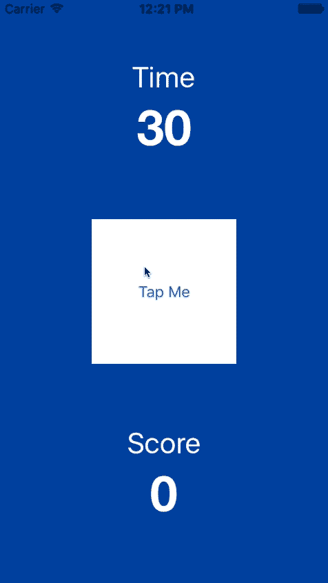

:page-layout: standard
:page-title: Year 10 IST - Tappity
:icons: font

= Year 10 IST - Tappity =

=== Description ===

You are going to write a simple iPhone game called Tappity. The aim of the game is to tap a button as many times as possible within 30 seconds.

Your game should look like the following screen shot (which has obviously been sped-up a bit):

The behaviour of the game should be as follows:

* The timer starts when the user taps the button for the first time.
* Every time the user taps the button the score increments by 1.
* When the timer reaches 0 an alert controller appears saying "Game Over" together with the user's score. The user can then tap the "Dismiss" which closes the alert view and also resets the timer and score, ready for the next game.

=== Hints ===

This game is a single-view application which uses many of the iOS (Cocoa Touch) controls with which you are already familiar, such as buttons and labels. Additionally, it uses many code features which you have been learning about including IBActions, IBOutlets, and UIAlertController.

Note, the alert controller which appears looks a bit different to what you have done in previous projects — this is because the style of the alert controller is an `.ActionSheet` rather than an `.Alert` (which you define when you create the UIAlertController). The only difference between these styles is their presentation — an `.ActionSheet` slides up from the bottom of the screen, whereas an `.Alert` style pops-up in the middle of the screen. Everything else is the same in terms of how you code and use them.

The dimensions of the button is 140 x 140

The game only needs to work in portrait orientation on an iPhone screen size of your choosing.

This requires the use of the `Timer` class.

=== Extension Activities ===

Finished the basic activity above? Here are some extension activities to keep you going and thinking.

. To distract the user, and make the game a bit more challenging, whenever the button is tapped make the background colour of the view change to a different colour. Cycle randomly between 10 different colours.

. Implement a feature to track the top 10 high scores in the game. When the user finishes the game if they have achieved a high score an alert view should appear with a text field, allowing them to enter their name and save their score. You will also need to implement a tab bar controller so the user can switch between the game view controller and the high scores view controller, which shows the top 10 high scores.

. Find a way to save the high scores so that they persist between executions of the game (i.e. if the game is closed and then re-opened the high scores persist). You may wish to look at NSUserDefaults as an easy way to save the game scores.

. *Fun Size Mars Bar Challenge:* To make the game a bit more tricky, make it so that the button randomly moves to a different position on the screen when it has been tapped. The button can go over other screen elements (such as the time remaining or the score). However, make sure that the button is always fully visible on the screen (e.g. it should never be half-off the screen/view).

. *Piece of fresh fruit challenge:* Use auto layout so that the app displays nicely on an iPhone device of any size.

. Get the application working in landscape. You will need to exercise some discretion in the position of the on screen elements, as having the timer on top and score on bottom probably won't work given the decreased height of the screen.

. *King Size Mars Bar Challenge:* Design a version of the app for watchOS. The entire screen of the app can be the button, and the score and time remaining can appear on the screen behind the button (so the user can just tap anywhere on the screen). If you don't have an Apple Watch that's fine, you can just test the app in the Watch simulator.
