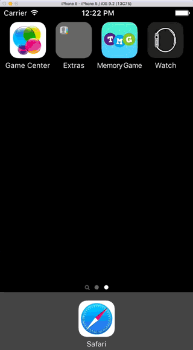

:page-layout: standard
:page-title: Year 10 IST - The Memory Game
:icons: font

= Year 10 IST - The Memory Game =

=== Description ===

The memory game consists of a 4 x 4 grid of blank squares. The player can tap a cell in the grid to show a symbol. They then need to tap another cell (revealing the symbol in that cell) with the aim of finding matching pairs. If a match is found, the symbols turn green and remain on screen. If a match is not found, the symbols disappear (after a 1 second delay) and the player tries again. The idea of the game is that over time the player learns the location of the various symbols (via trial and error) and can effectively determine which symbols and located where allowing them to match-up the pairs of symbols.

Below is an example of the game being played.

[.image-border]

=== Xcode Template Project ===

To save you from designing the user interface for this project, and dealing with auto-layout, a template project has been provided. Use this project as a basis for your submission.

link:activity2_tmg_template.zip[DOWNLOAD STARTER PROJECT]

The starter project has the user interface pre-configured which should work on all models of iPhone which support iOS 10. The app also only needs to work in portrait orientation. You should not need to modify the user interface / storyboard at all.

=== Hints ===

Here you can find various hints and tips to complete the assignment task.

* The symbols within the game are actually a font, so the symbols are just text on the label of the UIButton objects in the main view controller on the storyboard. There are 300 symbols available for use in the font. To make things easier for you, I have written a helper function on the String class to make accessing the symbols easy. All you need to do is call String.symbolForIndex(index), where index is an integer between 0 and 299 (inclusive). This will return a String which contains the symbol. For example:

....
let symbolString = String.symbolForIndex(246)
// symbolString will now be storing the symbol for an empty circle (which is symbol 246)
....

Note, you won't be able to print that string to the console for debugging as the console won't be able to display the symbol (as it's a special font).

* You will notice that when the symbols appear and disappear they have a fade animation. This is provided by UIKit without any special code needed, except you must set the title of the buttons using the setTitle(title: String?, forState state: UIControlState) method on the UIButton object. For example:
*
....
let symbolString = String.symbolForIndex(246)
button.setTitle(symbolString, forState: .Normal)
....

Will set the symbol on the button with a nice fade animation. You should only never need to use the .Normal state on the button in this app. Additionally, to have the symbol fade-out (when the button text is cleared) you cannot do the following:

....
button.setTitle(nil, forState: .Normal)

// or

button.setTitle("", forState: .Normal)
....

This will not result in an animation — instead, it will result in the text/symbol being removed with no animation. To trigger an animation you need to set a new string with content, even a blank space. For example:

....
button.setTitle(" ", forState: .Normal)
....

This will cause the button to be blank, with a fade animation (yes, I know this is a bit dodgy, but if you know a better way then I am keen to hear...).

* There are two ways to prevent a button from being enabled / interactable / responsive to events: the `.enabled` property and the `.userInteractionEnabled property`. You may find one (or perhaps even both) of these properties useful.

* I have written two helper functions to shuffle/randomise arrays. You'll probably only need to use one of them, but I have provided two for flexibility (as they do different things). See below for example usage of these functions:

....
// The .shuffle method will shuffle/randomise an array, and return a new array, leaving the original array unchanged

let arrayOne = [1, 2, 3, 4]
let arrayOneShuffled = arrayOne.shuffle()

// Results:
// arrayOne (unchanged) = [1, 2, 3, 4]
// arrayOneShuffled = [1, 4, 3, 2]

// --------------------------------------------------------------------------------

// The .shuffleInPlace method will shuffle/randomise an array, modifying that array

var arrayTwo = [1, 2, 3, 4]
arrayTwo.shuffleInPlace()

// Results:
// arrayTwo = [1, 4, 3, 2]
....
