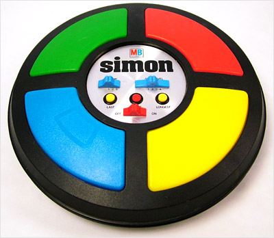
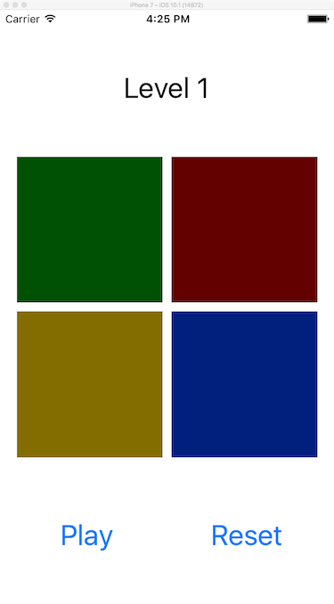

:page-layout: standard_toc
:page-title: Year 10 IST - Assignment Two
:icons: font

= Year 10 IST - Assignment Two =

*Weight:* 35% +
*Due:* Tuesday 18 May 2017 (Week 14) by 8:45am

== Changelog ==

This assignment was last updated on *Tuesday 4 April 2017*.

== What to Do ==

You need to implement an iPhone version of a memory game called Simon.

=== Game Overview ===

The non-computerised version of Simon looks like the picture below. The Simon game device has four coloured buttons. A round in the game consists of the device lighting up one or more buttons in a random order, after which the player must reproduce that order by pressing the buttons. As the game progresses, the number of buttons to be pressed increases. You can find out more information about the game at http://en.wikipedia.org/wiki/Simon_(game)[http://en.wikipedia.org/wiki/Simon_(game)^].

You need to design an iPhone version of this game which looks like the following:

The behaviour and workflow of the game should be as follows:

* The user taps the "Play" button to commence the game. One (random) square will light-up for 1 second. When the square is no longer lit, the user needs to tap that square. Assuming they get it correct, the level increments by one.
* The user now taps the "Play" button again to start the next round/level of the game. This time, two (random) squares will light-up, one after the other, each being illuminated for 1 second. Again, the user needs to tap the squares in order. Assuming they get it correct, the level increments by one.
* This cycle continues, each time with one extra random square lighting-up, until the user gets a sequence incorrect. At that point the game concludes with an alert view (showing the user's score) and the game resets once the alert view has been dismissed.
* The user can also reset the game at any time by pressing the "Reset" button. This will reset the level back to 1, ready to commence a brand new game when the user taps "Play".

Additional information:

* On each level/round you need to add one more light/button to the EXISTING sequence, not generate an entirely new sequence. For example:
** Level 1: Green
** Level 2: Green, Blue
** Level 3: Green, Blue, Red
** Level 4: Green, Blue, Red, Blue
** Level 5: Green, Blue, Red, Blue, Yellow
etc...
* Your assignments will be marked with at least Xcode 8.1. Please update your Xcode from the Mac App Store.
* When the user taps a square it should illuminate for as long as they have got their finger on the square (i.e. it is in contact with the square). This behaviour has already been implemented for you in the Xcode template (see below).
* When the user taps the "Play" button it should be disabled until the round/level is complete (or the player loses) to avoid the user tapping the Play button multiple times or in the middle of a game (which could result in undesirable behaviour).
* It is possible and legal for the same square to light-up consecutively (i.e. multiple times in a row, such as red-yellow-red-blue-blue-red). However, in this situation that square should momentary darken before it lights up again, so that it's clear to the user that it has lit-up a second time.

=== Template ===

To save you from designing the user interface for this project, and dealing with auto-layout constraints, a starter project has been provided. Use this project as a basis for your submission.

link:Assign2Template.zip[DOWNLOAD STARTER PROJECT]

The starter project has the user interface pre-configured which should work on all models of iPhone which support iOS 10. The app only needs to work in portrait orientation. The inactive and active graphics that you need are also already loaded into the Xcode project - when a button lights-up (either when the app is playing a sequence, or the user taps the button to replay the sequence) you should change the button graphic at that time to the `_active` version of the image.

=== Extension Activities ===

As some students may wish to extend their knowledge, here are additional extension activities for the assignment. *These do not attract any extra marks, and you WILL NOT be penalised or disadvantaged in the marking of this task if you do not complete these additional activities - it is completely your choice.*

*DO NOT COMPLETE THESE TASKS IN YOUR ACTUAL SUBMISSION.* If you wish to complete an extension activity (or multiple extensions) you still need to submit your base/standard assignment for marking. So, to complete the extensions duplicate your base assignment Xcode project and write the extension activities in the duplicate copy, which you can then submit separately for review. Make sure that your base solution is perfect - that's your priority as that's what you are being marked on, the extension activities are purely to extend your own knowledge and will not attract extra marks regardless of the quality of your base submission.

. Make the game interface replicate the actual design of the Simon game, rather than the fairly basic design we have done. You can search the internet and Google Images for graphics which you can use (e.g. searching for Simon game in Google images returns plenty of results which you could use in your implementation of the game - just make sure to reference the source of the images in your source code!).

. In the actual game of Simon when each button lights-up (either by the computer playing the sequence, or the user tapping the button) a sound plays. Using GarageBand (or alike) create the relevant sound files for the notes and make these play when the nominated buttons are activated in your game of Simon. The sounds in Simon were designed to always be harmonic, with the following notes played for each button:
** *Blue:* E-note
** *Yellow:* C#-note
** *Red:* A-note
** *Green:* E-note, an octave lower than blue

. For each 5th level which the user successfully completes, the amount of time each button lights-up for should be reduced by 0.1 seconds. For example: on levels 1 - 5 each button will light-up for 1 second, levels 6 - 10 each button will light-up for 0.9 seconds, levels 10 - 15 each button will light-up for 0.8 seconds, etc.

. Create a Settings view controller (which displays modally, you may wish to trigger the Settings by putting a UIButton of type UIButtonTypeInfoLight on your view - this is general convention for displaying information or settings about an application). Within the settings the user should be able to configure the default length of how long the buttons light-up for (which is usually 1 second, decreasing from there every 5th level) and also whether the time each button lights-up for should decrease every 5th level (i.e. enable or disable the functionality you added in extension activity 3).

. Implement a High Scores function, allowing user's to record their name and score for display on a leaderboard in the game.

. Implement a Game Center based leaderboard (high scores board) for the game. You will need a paid iOS Developer Subscription to access the Game Center APIs and functionality.

== Hints and Pro Tips ==

Here you can find various hints and tips to complete the assignment tasks.

* The biggest tip is to make sure that you start this assignment early. This is a major task worth 35% of your Semester One grade for this subject, and it is not something that you can complete over a weekend. You have plenty of time to complete this task so working consistently is the key.

* It is extremely important that you include comments within your code, together with using well-named variables and conforming to variable naming conventions (i.e. camelCase). When you start to develop more complex programs it is essential that you include such aspects to ensure that your code is understandable. Good internal documentation (commenting) and intrinsic documentation (variable naming) are hallmarks of good developers.

* Additionally, you must ensure that you have sufficient whitespace and that your code is indented to assist with readability. There's really no excuse for not intending your code, since Xcode provides a feature to automatically indent your code (or re-indent your code, should you mess it up - select the code that you would like to re-indent then go to the Structure > Re-Indent).

== Submission Instructions ==

This assignment is worth 35% of your Semester One assessment for this subject.

You must place the following declaration (in the form of a comment) at the top of your ViewController.swift file:

....
//
// This project is submitted as part of the assessment for Year 10 IST.
// This is all my own work. I have referenced any work used from other
// sources and have not plagiarised the work of others.
// (signed) Name here
//
....

**The declaration template has already been provided for you in the `ViewController.swift` file, but make sure that you change the name!**

To submit, ZIP your `Assign2Template` file and upload the file to http://submit.cgscomputing.com/year10-s1assign2[http://submit.cgscomputing.com/year10-s1assign2^]. Make sure to correctly enter your name and school email address, so that your submission can be located.

== Marking Guidelines ==

This assignment will be marked according to four axis:

* *Scope:* To what extend does your submission implement (or attempt to implement) the features required by the specification?
** We are interested in whether you made an *effort* to get your code to match the requirements.
** This doesn't necessary mean that your solution has to work, but you need to show that you have thought through the steps to _try_ to make it work.
** There's no reason that you should not always receive a 5 for scope, as you should always be putting in effort.
* *Correctness:* To what extend is your code consistent with the specifications and free of bugs?
* *Design:* To what extent is your code written well (i.e. clearly, efficiently, elegantly, and/or logically)?
* *Style:* To what extend is your code readable (i.e. commented and intended with variables appropriately named)?

Each axis will be marked on a five point scale:

* 5 = Excellent, essentially no room for improvement
* 4 = Very good, minor room for improvement
* 3 = Good, some room for improvement
* 2 = Fair, ample room for improvement
* 1 = Poor
* 0 = No attempt

Your final mark for this assignment will be calculated using the following formula:
`Final Mark = Scope × (3 × Correctness + 2 × Design + 1 × Style)`

As you can see, we place the most importance and weighting on scope - the effort which you invest in your submission to try and meet the requirements.

[footnote]##Based upon Harvard University https://cs50.harvard.edu/[CS50's^] grading, used and adapted with permission. Thanks to Prof. David J. Malan.##

*Late submissions will incur penalties as per the school assessment policy:* Students will lose 10% of the total value of the assessment per day late, or part thereof. *Be aware, if you do not submit your assignment by 8:45am on Thursday 18 May 2017 that is counted as a day late and will attract the 10% penalty.* Weekends equate to 2 days. On the second day of non submission parents will be informed. A student may be directed to study support to complete an overdue assessment task. After 4 days, a student who has not submitted an assessment task will receive an academic detention. Work completed during academic detention or submitted more than 4 days late will have 50% of the total value of the assessment deducted from the student's score. If the work remains incomplete despite the academic detention, the student will receive zero marks for the task.

=== Draft Submissions ===

You may optionally submit one draft of your assignment for review prior to formal submission. Your draft must be feature complete (i.e. not a half-done assignment) and submitted at least one week before the assignment due date - for this assignment, *drafts are due by 8:45am on Thursday 11 May 2017*.

Please email your draft to Mr Purcell for review.

=== Outcomes/Assessment Criteria ===

* 5.1.1 select and justify the application of appropriate software programs to a range of tasks
* 5.2.1 describe and apply problem-solving processes when creating solutions
* 5.2.2 design, produce and evaluate appropriate solutions to a range of challenging problems
* 5.2.3 critically analyse decision making processes in a range of information and software solutions

[#_academic_honesty]
== Academic Honesty

include::../common/academic_honesty.adoc[]
