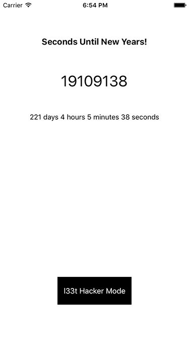
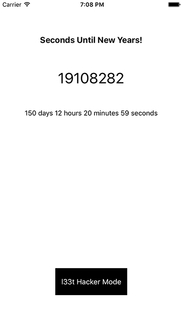
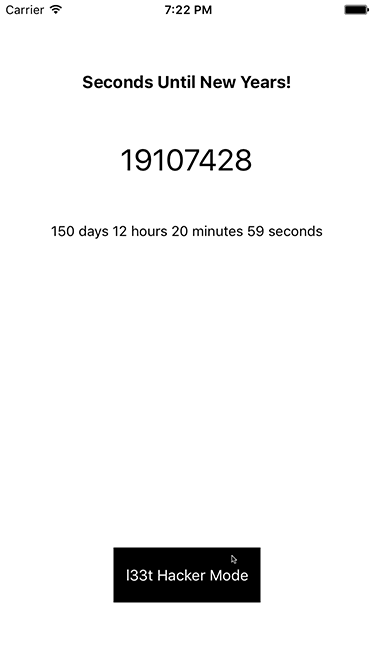
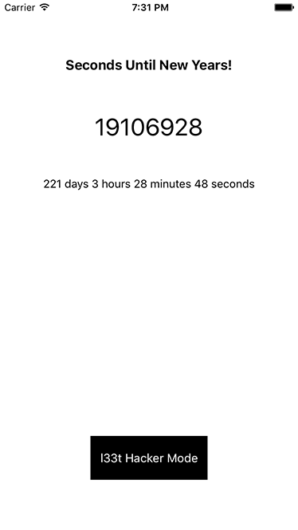
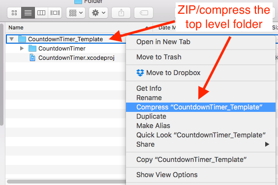

:page-layout: standard_toc
:page-title: Year 10 IST - Common Test
:icons: font

= Year 10 IST - Common Test =

*Weight:* 35% +
*Issued:* Monday 5 June 2017 (Week 17) at 4:00pm +
*Due:* Tuesday 6 June 2017 (Week 17) at 8:45am

== Task Requirements ==

Your company is designing an iPhone app which provides a countdown to new year celebrations! Unfortunately, the software engineer looking after this project has gone on holidays and the boss needs this app completed as soon as possible to meet their deadline. The software engineer has left quite a bit to be done, and you'll need to finish these so the app fully works.

link:CountdownTimer_Template.zip[You can download the incomplete project (which you need to finish) from here].

The app looks like this:

[.image-border]

All the user interface design has been completed, so you just need to hook-up the UI and write the code to make it work. Note, it is your responsbility to create the necessary `IBOutlets` and `IBActions` in the view controller and hook those up - they are not provided.

*There are no auto layout constraints on the storyboard, so this only needs to display on the iPhone 7 simulator.*

There are four tasks you need to attempt, each worth a certain number of marks.

=== Task 1: Countdown in Seconds (5 marks) ===
When the app launches it calculates the number of seconds between now and 31 December 2017 at 11:59:59pm (i.e. midnight, and the new year). This is done in the `viewDidLoad` method and is stored in a variable called `interval`. This has already been done for you.

You need to write code so that this interval decrements every second (which makes sense, since every second brings us closer to new years) and updates the label on the view. This results in the label counting down and displaying the real-time number of seconds until the new year.

See the example below:

[.image-border]

=== Task 2: Stop at Zero (4 marks) ===

This is pretty simple. Write code so that when the countdown reaches zero (i.e. new years) it stops and does not continue decrementing into negative values!

=== Task 3: l33t Hacker Mode(TM) (10 marks) ===

Write code so that when the *l33t Hacker Mode* button is tapped it toggles between light mode and dark mode. Make sure you look carefully at the example below to see what needs to change on the UI in response to l33t Hacker Mode(TM) being enabled or disabled.

Note, all colours are either `UIColor.black` or `UIColor.white`. There are no other colours.

[.image-border]

=== Task 4: Friendly Time Format (10 marks) ===

Not everyone can easily do a conversion in their head from seconds into days, hours, minutes, and seconds. To make this easier, you have decided to implement this conversion and display the countdown in an easier to understand format.

Write code so that below the countdown in seconds there is a more user-friendly time format - which displays the real-time countdown in days, hours, minutes, and seconds.

See the example below:

[.image-border]

You *do not* need to account for daylight savings, when a hour is lost between now and new years.

=== Code Style (6 marks) ===

The final 6 marks of this assignment are for code style - such as good variable/constant naming, whitespace, and indentation.

*You do not need to comment your code for this task.*

== Submission ==

This task is marked out of 35 and will form 35% of your assessment for Semester One.

You need to ZIP the *entire* Xcode project folder and submit to http://submit.cgscomputing.com/year10-commontest[http://submit.cgscomputing.com/year10-commontest^] by 8:45am on Tuesday 6 June 2017.

[.image-border]

== Academic Honesty

Unlike assignments where you can seek help from others, and collaborate (at a high-level) over the assignment, as this is a take-home test *YOU MAY NOT COLLABORATE WITH ANYONE ELSE ABOUT THIS TASK*. It must be purely done by yourself and you cannot seek help from anyone, apart from researching online (as discussed in the previous section about the test being open-resource).

It is very clear when someone has collaborated with others on a task, so if any source code bears similarities to other people they will be issued with an immediate zero without any further discussion.

NOTE: Those students who have already received warnings about working too closely with other students on assignments will have their submission for this assignment under particular scrutiny for potential collaboration.

== Outcomes to be Assessed ==

* 5.1.1 selects and justifies the application of appropriate software programs to a range of tasks
* 5.2.1 describes and applies problem-solving processes when creating solutions
* 5.2.2 designs, produces and evaluates appropriate solutions to a range of challenging problems
