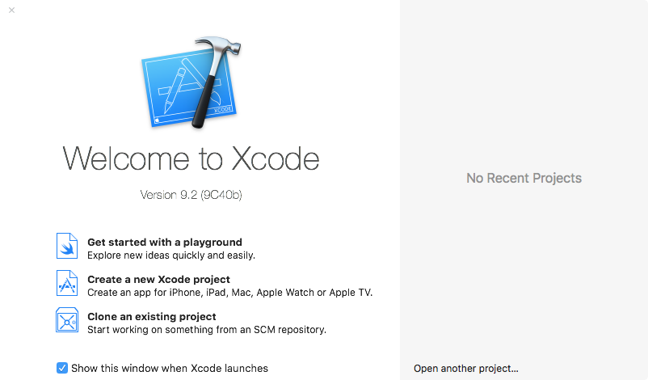
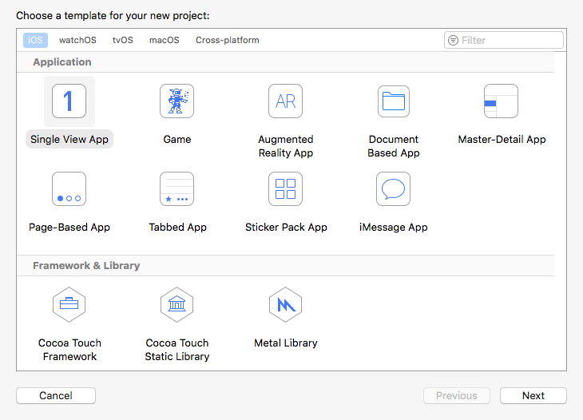
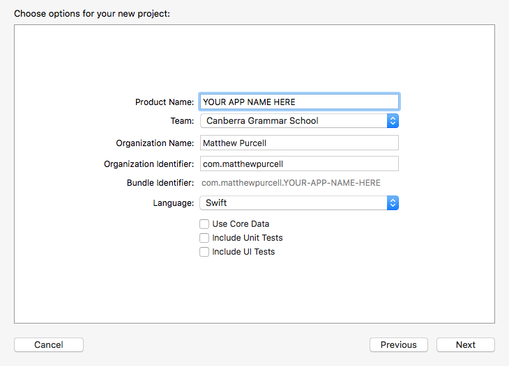

:page-layout: standard
:page-title: Year 10 IST - Creating a new iOS Xcode Project
:icons: font

= Year 10 IST - Creating a new iOS Xcode Project =

Open Xcode and the following screen should appear:

[.image-border]

Click *Create a new Xcode project*.

If this splash screen doesn't appear, you can instead go to the *File* menu > *New* > *Project* to achieve the same thing.

'''

=== Project Template ===

In the next window, select *Single View App* and click *Next*.

[.image-border]

'''

=== Project Settings ===

In this next window, configure the app as follows:

- *Product Name:* This should be the name of your app
- *Team:* You can leave this as-is, no need to change this setting
- *Organization Name:* Type your own name
- *Organization Identifier:* Make this in the format of `com.` followed by your name in all lower case without spaces

Make sure the language is set as *Swift* and leave the three other tick boxes unticked. Click *Next*.

[.image-border]

'''

=== Save the Project ===

In this final window, save your project to a location on your computer. You do not need to create a folder for the project, Xcode will automatically create a folder (with the product name, defined in the previous step) containing all the files for this Xcode project.

I strongly suggest that you have a folder on your computer called *Year 10 IST* (or similar) where you can store all your Xcode projects. Do not just dump it onto your desktop or in your documents folder, as you will be creating a lot of projects and you don't want to get them mixed up, lost, or accidentally deleted.

[.image-border]

'''

=== Profit ===

Xcode will create and then open your project. Enjoy Xcoding!

