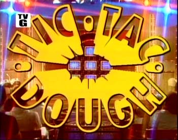
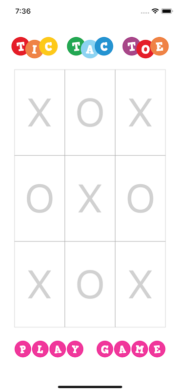

:page-layout: standard_toc
:page-title: Year 10 IST - Assignment Two
:icons: font

= Year 10 IST - Assignment Two =

*Weight:* 45% +
*Due:* Tuesday 22 May 2018 (Week 14) by 8:45am

== Changelog ==

This assignment was last updated on *Monday 16 April 2018*.

* *UPDATE 16 April 2018:* There was an issue in the template where user interaction was disabled on the first two rows of buttons. This has now been corrected. For more information, see the following forum thread: https://forum.cgscomputing.com/t/bug-in-it-assignment-and-potentially-template/312

== Project Overview ==

You may recall that last year you were recruited to finish the implementation of a JavaScript version of Tic Tac Toe for the up-and-coming revival of the 1950s TV show — *Tic Tac Dough!*

You will be glad to know that the premiere of the series was a resounding success, so they have employed you to write an iPhone version of the game.

You may also recall that for the JavaScript version last year you finished a partially complete version of that game, as the senior software engineer taking lead on the project decided to book a one-way plane ticket and go on "vacation" to the Bahamas. He has since been sacked, so you will need to implement the entirety of the iPhone app entirely yourself.

=== Game Overview ===

For this task you will be creating an iPhone implementation of the game Tic Tac Toe (also known as Noughts and Crosses). This is a human vs. computer version of the game, so you will need to write a computer player with some degree of artificial intelligence (don't worry, this will be explained later in more detail). The game only needs to work on iPhone in portrait orientation.

Your program will look like the screen shot below:

[.image-border]

The video below shows the game play of the app:

video::sample-video.mp4[width=380]

* When the game initially loads the user taps "Play Game" to start. The game will randomly select the computer or human to play first. The human can tell who has been selected to play first as a message will appear below the grid saying "Computer's Turn" or "Your Turn".

* When it's the humans turn, they can click any empty square to place their marker (X) in that square. If they click a square which already has a marker then a message appears informing the user that they must select a different square.

* When it's the computer's turn, it always follows a three-step procedure when determining where to place its marker:
1. *Can I win?* The computer will determine whether it already has two in a row. If so, it will complete the sequence to win the game.
2. *Can I block?* The computer will check whether the human has two in a row. If so, it will block them to prevent the human from completing the sequence on their next go.
3. If neither of the two conditions exist then the computer will randomly place its marker in a empty cell within the grid.

*Note:* There is always a 1 second delay between when the computer starts it's turn, and when it places its marker. This is purely for user experience, as it gives the impression that the computer is "thinking" and is less jarring to the human player than immediately having the computer place its marker after the human has placed their marker.

* After each turn of the computer or human the program will check whether there is a winner (i.e. one of the players has completed their sequence of three markers). If there is no winner, the program will then check whether it's a draw (i.e. all the squares are complete, but there is no winner). If there's no winner and no draw then the game must still be going so it will pass control back to the next player to continue.

* When the game is complete a message appears informing who is the winner, and their winning combination is highlighted in yellow. The user can then tap "Play Game" to reset and commence a new game.

=== Template ===

To save you from designing the user interface for this project, and dealing with auto-layout constraints, a starter project has been provided. Use this project as a basis for your submission.

link:TicTacToe_Template.zip[DOWNLOAD STARTER PROJECT]

The starter project has the user interface pre-configured which should work on all models of iPhone which support iOS 11. The app only needs to work in portrait orientation.

You can modify/edit/remove the code in the sample project if you like, although the code was useful when I wrote the solution so (unless you really know what you're doing) you might want to keep it.

=== Bonus Marks ===

Similar to the first assignment there is an extension mark band. However, instead of being a mark band, for this task you can get up to 2 bonus marks.

In order to access the bonus marks you need to implement two additional features:

1. A high score system via Game Center - which allows the high scores for your game to be recorded in Game Center with score and name. *(1 mark)*

2. An online player vs. player system via Game Center - where two people can verse each other at Tic Tac Toe online through Game Center. *(1 mark)*

The above two tasks are very difficult and only intended for advanced programmers who are looking for a challenge...and want to get the elusive one or two bonus marks for this task.

Note, because there are bonus marks on offer it is (interestingly) possible to get over 100% in this task - with the highest possible mark being 104%.

== Hints and Pro Tips ==

Here you can find various hints and tips to complete the assignment tasks.

* The biggest tip is to make sure that you start this assignment early. This is a major task worth 45% of your Semester One grade for this subject, and it is not something that you can complete over a weekend. You have plenty of time to complete this task so working consistently is the key.

* It is extremely important that you include comments within your code, together with using well-named variables and conforming to variable naming conventions (i.e. camelCase). When you start to develop more complex programs it is essential that you include such aspects to ensure that your code is understandable. Good internal documentation (commenting) and intrinsic documentation (variable naming) are hallmarks of good developers.

* Additionally, you must ensure that you have sufficient whitespace and that your code is indented to assist with readability.

== Submission Instructions ==

This assignment is worth 45% of your Semester One assessment for this subject.

You must place the following declaration (in the form of a comment) at the top of your `GameViewController.swift` file:

....
//
// This project is submitted as part of the assessment for Year 10 IST.
// This is all my own work. I have referenced any work used from other
// sources and have not plagiarised the work of others.
// (signed) Name here
//
....

**The declaration template has already been provided for you in the `GameViewController.swift` file, but make sure that you change the name!**

To submit, ZIP your `Assign2Template` file and upload the file to http://submit.cgscomputing.com/year10-s1assign2[http://submit.cgscomputing.com/year10-s1assign2^]. Make sure to correctly enter your name and school email address, so that your submission can be located.

== Marking Guidelines ==

[cols="<8,^1"]
|===

^|*Criteria*
^|*Mark Range*

{set:cellbgcolor:white}

.^|
*Submissions in this mark range will:*

• include a fully working set of Xcode project files.

• replicate the look and behaviour of the sample app, as described on this page and shown in the example video.

• have game algorithms which are well designed, elegant, and robust.

• have program code which is well structured, using functions where suitable to assist with the reusability of the code.

• use appropriate Swift/UIKit methods and functions.

• use appropriate data types to represent particular items in the app.

*In addition, submissions in this mark range will:*

• include well-named variables (i.e. variable names reflect their purpose, use of camelCase).

• include the use of whitespace, indenting, and other methods to assist in code readability.

• include sufficient comments to explain the purpose of the code.

• run with no errors or warnings *at all*.

• not crash or exhibit any unexpected or unwanted behaviour *under any operations*.
.^|45 - 40

.^|
*Submissions in this mark range will:*

• a fully working set of Xcode project files.

• replicate the look and behaviour of the sample app, with some minor exception(s).

• have game algorithms which are well designed and functional.

• have program code which is reasonably well structured, and include the use of functions.

• use appropriate Swift/UIKit methods and functions.

• use appropriate data types to represent particular items in the app.

*In addition, submissions in this mark range will:*

• include well-named variables (i.e. variable names reflect their purpose, use of camelCase).

• include the use of whitespace, indenting, and other methods to assist in code readability.

• include sufficient comments to explain the purpose of the code.

• run with no *major* errors or warnings.

• not crash or exhibit any unexpected or unwanted behaviour *under normal operations* (excluding edge-cases).
.^|30 - 39

.^|
*Submissions in this mark range will:*

• a mostly working set of Xcode project files.

• attempt to replicate the look and behaviour of the sample app, with exceptions.

• demonstrate an attempt at proper algorithm design.

• use some appropriate data types to represent particular items in the app.

*In addition, submissions in this mark range will:*

• include *some* well-named variables (i.e. variable names reflect their purpose, use of camelCase).

• include *some* use of whitespace, indenting, and other methods to assist in code readability.

• include *some* comments to explain the purpose of the code.
.^|20 - 29

.^|
*Submissions in this mark range will:*

• look and behave somewhat like the sample app.

• use some appropriate data types to represent particular items in the app.

• attempt to write algorithms to address the requirements.

.^|10 - 19

.^|
• A non-serious attempt at the task with some reference to the requirements.
.^|1 - 9

.^|

• A completely non-serious attempt at the task.

OR

• A submission that is plagiarised.
.^|0

|===

*There are also up to two bonus marks available for those who attempt the Bonus Mark activities*

*Late submissions will incur penalties as per the school assessment policy:* Students will lose 10% of the total value of the assessment per day late, or part thereof. *Be aware, if you do not submit your assignment by 8:45am on Tuesday 22 May 2018 that is counted as a day late and will attract the 10% penalty.* Weekends equate to 2 days. On the second day of non submission parents will be informed. A student may be directed to study support to complete an overdue assessment task. After 4 days, a student who has not submitted an assessment task will receive an academic detention. Work completed during academic detention or submitted more than 4 days late will have 50% of the total value of the assessment deducted from the student's score. If the work remains incomplete despite the academic detention, the student will receive zero marks for the task.

=== Draft Submissions ===

You may optionally submit one draft of your assignment for review prior to formal submission. Your draft must be feature complete (i.e. not a half-done assignment) and submitted at least one week before the assignment due date - for this assignment, *drafts are due by 8:45am on Tuesday 15 May 2018*.

Please email your draft to Mr Purcell for review.

=== Outcomes/Assessment Criteria ===

* 5.1.1 select and justify the application of appropriate software programs to a range of tasks
* 5.2.1 describe and apply problem-solving processes when creating solutions
* 5.2.2 design, produce and evaluate appropriate solutions to a range of challenging problems
* 5.2.3 critically analyse decision making processes in a range of information and software solutions

[#_academic_honesty]
== Academic Honesty

include::../common/academic_honesty.adoc[]
