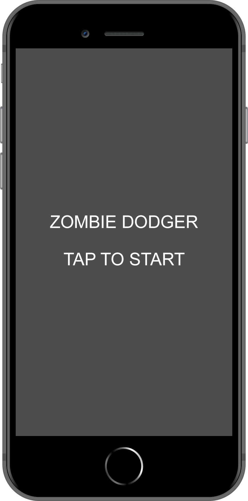
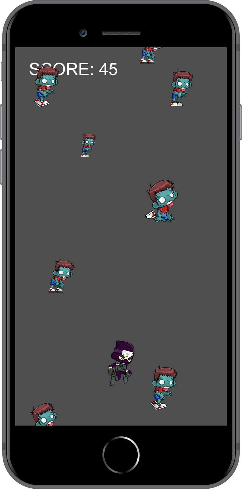
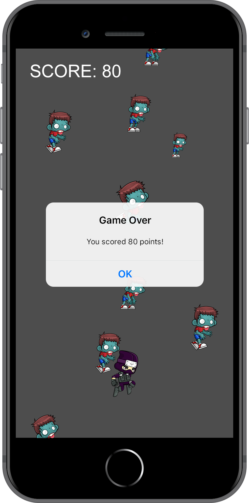

:page-layout: standard_toc
:page-title: Year 10 IST - Assignment Two
:icons: font

= Year 10 IST - Assignment One (Semester Two) =

*Weight:* 30% +
*Due:* Tuesday 4 September 2018 (Week 7) by 8:45am

== Changelog ==

This assignment was last updated on *Thursday 12 July 2018*.

== Task Description ==

For this assignment you are going to be developing a game called Zombie Dodger. The concept of the game is that zombies fall from the top of the screen and the player (in this case, the ninja character) needs to avoid them. The ninja can be controlled by the player with their mouse (i.e. clicking and dragging the ninja around to avoid the falling zombies). Similarly, if the game is being run on an actual device then the ninja is controlled by the player with their finger by tap, hold, and dragging the ninja.

The longer the player lasts without being hit by a zombie, the higher their score.

Some screen shots of the key game screens/scenes are included below.

.Example splash screen
[caption="", link=zombie_dodger1.png]

.Example game screen
[caption="", link=zombie_dodger2.png]

.Example end game screen
[caption="", link=zombie_dodger3.png]

A video of a sample game/app, which you need to replicate, is not being provided for this assignment &mdash; we want you to develop this game with your own flair. *Your game does not need to look identical to the screen shots above &mdash; it just needs to function consistent the description and minimum requirements of the game* which are outlined below (and also in the <<_marking_guidelines, marking guidelines>>). So long as your game meets these requirements, and is true to the concept of the game, you will get your marks!

There is also no template, you will need to create your Xcode project from scratch.

_Why are we doing this? I want a sample app!_ The reason is that, now you have experience in game development through the Pong and Breakout examples completed during class, we want you to make decisions about how the gameplay should work so that you can produce a playable game. It also means that when marking we are looking at your game as a whole, rather than specifically looking to see whether you exactly replicated a sample app we gave you &mdash; making it much easier to award you marks!

=== Game Description and Minimum Requirements ===

The game should following this general workflow:

* When the app starts it should present the player with a splash screen which they tap to start the game. This avoids the situation where the app loads and the game immediately starts, but the player might not be ready (or expecting) the game to start. See the _Example splash screen_ above for an idea about what is expected.

* When the game first launches the ninja character should start in the middle of the screen. Zombies, of different sizes and different images, should then spawn and drop from the top of the screen. To make the game achievable, new zombies should spawn and drop around every 3 - 4 seconds. You will need to make your own judgment about how fast they should fall. Remember, the game should be challenging but achievable.

* The graphics you need (ninja and four different zombie variants) can be http://year10.cgscomputing.com/2018/s2assign1/game_textures.zip[download here].

* The player gets 1 point for every second they are "alive", so each second that goes past should increment the score by 1.

* If the ninja contacts any of the zombies then it's game over &mdash; the game should pause, an alert (or similar) should appear showing the player's score, and then a button (or similar) allows the user to go back to the main splash screen and start a new game, if they wish.

IMPORTANT: This game only needs to be designed for the iPhone 8 Plus. You do not need to consider or design for any other screen sizes.

=== Getting Started ===

This might look like a complicated game, but we have specifically designed this assignment to leverage what you have already learned in class through the Pong and Breakout examples &mdash; just applying the concepts in a slightly different way. Here are a few tips to get you started.

* Remember, always go for the easy stuff first. Probably the easiest thing to get working at the beginning is moving the ninja character with your touch (or mouse). Once you have got the ninja sprite on the screen then moving the character is just like you did in Pong...but is actually easier (because in Pong you had to put extra code to restrict the movement to only the x axis &mdash; whereas in Zombie Dodger you want free movement).

* Spawning the zombies. We did something similar in the Breakout example, where we randomly spawned blocks. Using a timer (or similar) which ticks every 3 - 4 seconds you will want to create a new `SKSpriteNode` in code to represent a zombie, randomly assign one of the four zombie textures to the sprite, and then randomly position it somewhere on the x axis (on the screen). Don't worry about the y axis, always spawn it at the same y point _just_ off the top of the screen (as then the zombies will "fall" onto the screen).

* Speaking of the zombies dropping down the screen, you can just use gravity...and adjust the gravity level to change the speed at which the zombies drop.
+
*Pro Tip:* You'll need to configure the zombies so they are affected by gravity, and configure the ninja so it is not affected by gravity.

* Collision detection. This is just like how you detected collisions in Pong.
+
*Pro Tip:* The textures are not perfect shapes (e.g. squares, circles) but they are transparent PNGs &mdash; so to get a nice tight fit for the physics body you might want to look at using the option to create the physics body using the alpha channel (transparency) of the texture.

* Score. Just use a timer to increment the score by one each second.

* End of game alert. You did that in Pong!

* What about the two different screens (splash screen and game screen)? Hmm...you might need to experiment with having two scenes &mdash; we'll leave that one up to you :)

=== Extension (Bonus) Marks ===

Once again, it is possible to get over 100% in this task. There are five extension tasks which you can attempt to get bonus marks. These are not compulsory and you will not be disadvantaged if you do not attempt these additional tasks &mdash; they are designed for students who would like an additional challenge.

1. Style the game a bit nicer than the current bland and uninteresting fonts, colour combinations, lack of graphics, etc. You need to keep the provided ninja and zombie textures &mdash; but you can style other aspects.

2. Implement another label which shows the highest score which has been achieved in the game overall.
+
_...and for an additional mark:_ have the highest score persist between open/closes of the game (i.e. if the user entirely exits the game and re-opens then the high score should persist). You may want to look at using `NSUserDefaults` to help.

3. Every 20 seconds increase the difficulty of the game by making the zombies fall *slightly* faster and spawn more frequently. The key here is slightly, you almost want the player not to realise the game is getting more difficult!

4. Implement a power-up where the ninja needs to contact the power up to receive its special powers. The power up should only appear very occasionally. When activated, will make the game go very quickly for 10 seconds and give the ninja invincibility...essentially giving them free points while the power up is active. You can work out the finer details of how this should operate.

5. Animate the ninjas and zombies. The textures you have been provided are just a few still frames from multi-frame textures which are designed to be animated (giving the ninja and zombie the appearance of movement through cycling through a set of textures frames quickly). Download the http://year10.cgscomputing.com/2018/s2assign1/zombie_textures.zip[zombie texture pack] and the http://year10.cgscomputing.com/2018/s2assign1/ninja_textures.zip[ninja texture pack] here.

You can attempt any (or all) of the above extension tasks in any order (you do not need to complete the first task to complete the second, etc. &mdash; each task is designed to be standalone).

*For each task you successfully complete you will receive 1 bonus mark*. This kind of thing also reflects favourably on your effort report for the subject, particularly _Independent Approach to Learning_).

IMPORTANT: *If you attempt any of the extension tasks then please put a comment at the top of your JavaScript code telling us which extension task(s) you attempted.* If you do not then it is difficult for us to tell what you have done and you will not receive any bonus marks!

=== Credits ===

The texture packs (zombies and ninja) were sourced from https://www.gameart2d.com/freebies.html[Game Art 2D^] and are available for use under a https://www.gameart2d.com/license.html[Creative Commons Zero licence^].

=== Outcomes/Assessment Criteria ===

* 5.1.1 select and justify the application of appropriate software programs to a range of tasks
* 5.2.1 describe and apply problem-solving processes when creating solutions
* 5.2.2 design, produce and evaluate appropriate solutions to a range of challenging problems
* 5.2.3 critically analyse decision making processes in a range of information and software solutions

== Submission Instructions ==

This assignment is worth 30% of your Semester One assessment for this subject.

You must place the following declaration (in the form of a comment) at the top of your main view controller file:

....
//
// I am committed to being a person of integrity.
// This project is submitted as part of the assessment for Year 10 IST.
// This is all my own work. I have referenced any work used from other
// sources and have not plagiarised the work of others.
// (signed) Name here
//
....

Make sure you understand the implications of this declaration which you are including and digitally signing (see the <<_academic_honesty, Academic Honesty>> section of this document for more information).

*If you do not include the student declaration at the top of your JavaScript file your assignment will not be marked and you will receive zero.*

To submit, ZIP your *entire Xcode project folder* and upload the file to http://submit.cgscomputing.com/year10-s2assign1[http://submit.cgscomputing.com/year10-s2assign1^]. Make sure to correctly enter your name and school email address, so that your submission can be located.

*Late submissions will incur penalties as per the school assessment policy:* Students will lose 10% of the total value of the assessment per day late, or part thereof. *Be aware, if you do not submit your assignment by 8:45am on Tuesday 4 September 2018 that is counted as a day late and will attract the 10% penalty.* Weekends equate to 2 days. On the second day of non submission parents will be informed. A student may be directed to study support to complete an overdue assessment task. After 4 days, a student who has not submitted an assessment task will receive an academic detention. Work completed during academic detention or submitted more than 4 days late will have 50% of the total value of the assessment deducted from the student's score. If the work remains incomplete despite the academic detention, the student will receive zero marks for the task.

=== Draft submissions ===

You may optionally (but strongly encouraged) submit one draft of your assignment for review prior to formal submission. Your draft must be feature complete (i.e. not a half-done assignment) and submitted at least one week before the assignment due date - for this assignment, drafts are due by 8:45am on Tuesday 28 August 2018). To submit a draft email your teacher with a ZIP copy of your project.

[#_marking_guidelines]
=== Marking Guidelines ===

link:marking-guidelines.pdf[Your assignment will be marked following the criteria in this PDF file.^]

*Note:* These marking guidelines are subject to change/update &mdash; particularly if something is brought to our attention we didn't consider when writing the assignment. Any such updates will be highlighted in the changelog.

[#_academic_honesty]
== Academic Honesty

include::../common/academic_honesty.adoc[]
